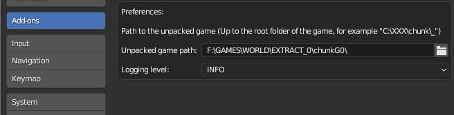
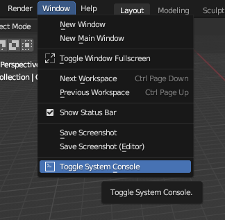
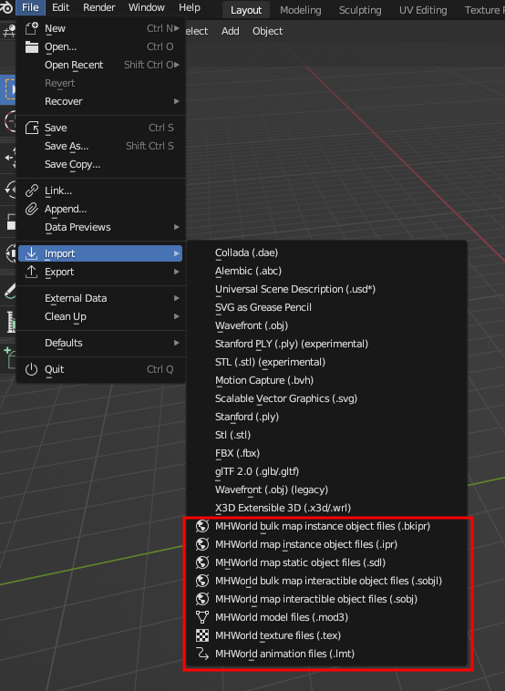
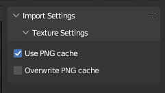
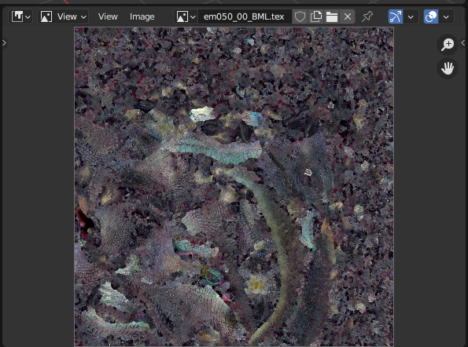
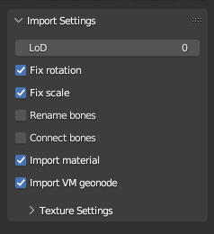
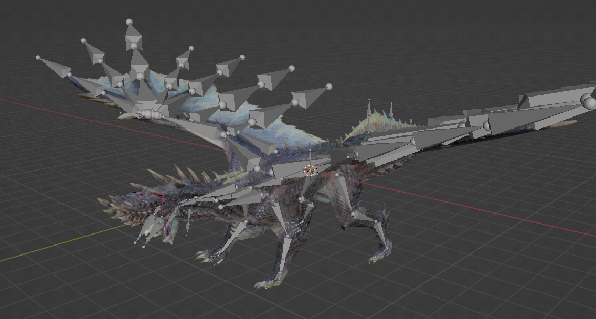
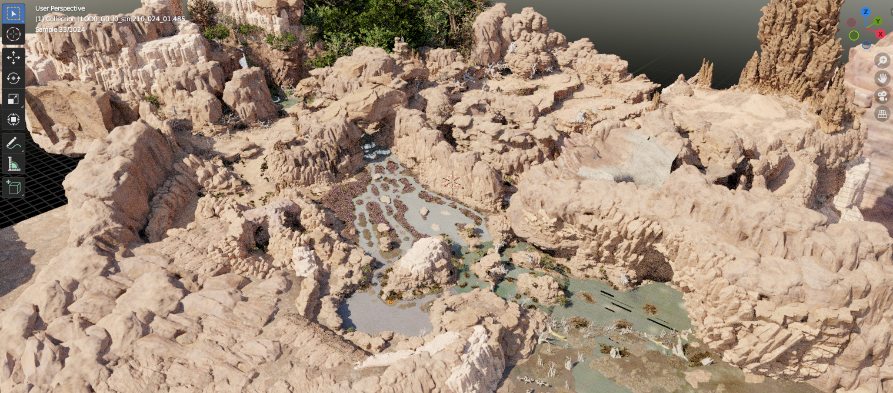
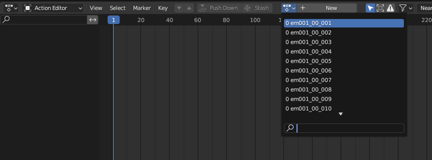

# Blender Monster Hunter World import suite

This blender addon provides a suite of file importers for Monster Hunter World files.

## Prerequisites

Tested for blender 3.6+, however a breaking change is coming for blender 4.1 related to normals import. The addon will be updated when it happens.

This addon is independant, and doesn't require external tools to work. Textures are imported using compiled code, whose shared libraries were tested for Windows and Ubuntu 22.04. Further platforms can be supported by compiling the code, following the steps further bellow.

Game files are normally stored in archives, which can be extracted by following the steps described in [this tool](https://www.nexusmods.com/monsterhunterworld/mods/6).

Some files, like materials and maps, reference other files. To import them correctly, it is required to provide the path to the root of the game files to the addon. You will get an error message telling you to do that if you attempt it.



A lot of information is written in the console, such as if an object failed to be importerd or was filtered away. If the console isn't opened by default, you can access it through the following menu:



## Installation

Download the .zip file provided in one of the releases, and install it in blender's extension manager. 

The importers can then be found here:



## Supported types

### Textures (tex files)

Texture files are supported at import. Since blender is optimized to load more standard image formats, when a texture is loaded, a .png equivalent will automatically be created alongside it.



The next time that texture is loaded, the importer will use the .png file instead for a much faster loading time. This is enabled with the "Use PNG cache" setting shown at import.

You can overwrite the already generated .png images by checking the "Overwrite PNG" checkbox. 



Note: some texture formats, most notably BC6 (used by skyboxes) are not supported for now. Which texture could be loaded or not is shown in the logs of the addon, in the python console.

### Meshes (mod3 files)

Meshes files are supported at import and export. You can import a specific Level of Details (LoD) ; a lower number means the model will be more detailed. When importing a mesh, you'll have the option to also import the material file associated to it automatically. 




Some quality of life features have been included like bone connection and bone renaming, although both of these features are pure guesswork, and will probably break animations.



### Maps

Map files are supported at import. They are generally stored in the "stage" directory in the game file. Maps are divided into zones, each contained into its own folder. Generally, there is a "common" folder in each map, that contains "bulk" files that reference the files of each individual zones. If you wish to import a full map, import the bulk files, while if you wish to import only a single zone, import the regular files.

The following files are supported:

- ipr: This file type contains objects that are instanced a lot of times (rocks, folliage, trees). They are found in the "etc" folders.
- bkipr: This bulk file type references many .ipr files. They are found in the "etc" folders.
- sdl: This bulk file type contains unique meshes of maps, like the gound, or other structures. It also contains references to other .sdl files. They are found in the "sdl" folders.
- sobj: This file type contains interactible objects, like gathering points. They are found in the "set" folders.
- sobjl: This bulk file type contains references to many .sobj files. They are found in the "set" folders.



Note: Texture loading takes time, but due to various optimizations described above, the second time a texture is loaded should take far less time than the first. Loading a map can take either multiple minutes or 2 seconds depending on that.

### Animations (lmt)

Animation files are supported at import. Due to a mismatch between the way blender and the game handle animations, a target armature is needed to apply the proper corrections when importing an animation. Make sure you have a single armature selected when doing so. 

LMT files are found in "mot" folders scattered around in the game files.



Animations will be loaded as actions. 


## Image importer compilation

The image reading code was written in C for speed reasons, and the source code of it is included in this addon.

If your platform isn't supported and you're reading this, you probably know better than me how to compile a shared library for it. In my case, the Ubuntu shared libraries were generated using the following argument in GCC: 

```
gcc read_dxgi_format.c -O3 -g -fopenmp -fPIC -c -o read_dxgi_format.o ; gcc read_dxgi_format.o -shared -fopenmp -o read_dxgi_format.so
```

## Credits

Most of the code written here wouldn't have been possible without the effort of the modding comunity. Most of the logic behind it is based on previous great importers like [this](https://github.com/AsteriskAmpersand/Mod3-MHW-Importer) one and [this](https://github.com/Strackeror/MHW-LMT-Loader) one. Many thanks to their authors!

I also want to thank [IvoryLagiacrus](https://twitter.com/ilagiacrus) for his general help with the files, his work on the materials, and his support and help on the way.

Many thanks to [TurboTimmy](https://github.com/TurboTimmy123), who demonstrated that maps was importable in blender with his tools, and to everyone that helped in the debugging process, like Pitt, Nythralix, Darto and all the others!
